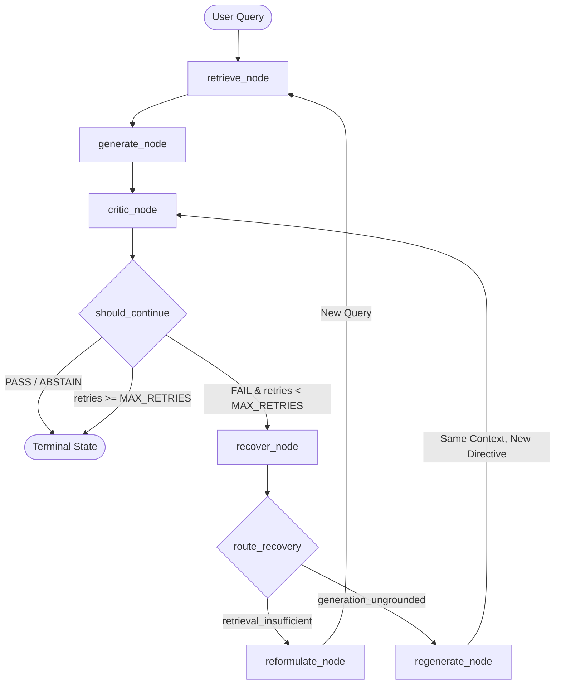

# Self-Healing RAG: Architectural Specification

This document details the architectural design, component interactions, state machine mechanics, and invariant guarantees of the Self-Healing RAG system.

---

## 1. System Topology & Graph Lifecycle

The core pipeline is governed by a cyclical state machine compiled with **LangGraph**. Unlike naive linear RAG (retrieve -> generate), Self-Healing RAG treats generation as a provisional hypothesis that must be validated by an objective Critic before returning to the user.

---

## 2. Component Taxonomy & Responsibilities

### 2.1 Ingestion & Vector Storage (`src/ingestion/`)
* **`DocumentLoader`**: Robust loader supporting `.txt`, `.md`, and `.pdf` (via `pypdf`). Preserves file metadata and page numbers.
* **`RecursiveCharacterChunker`**: Hierarchical text chunker splitting along natural boundaries (paragraphs, sentences, words). Generates deterministic chunk IDs using `SHA-256(document_id + chunk_index + content)` to prevent duplicate entries (D-006).
* **`LocalEmbedder`**: Encapsulates `sentence-transformers` (`all-MiniLM-L6-v2` by default), running locally on CPU/GPU without network latency or external API costs.
* **`VectorStore`**: Manages an embedded `chromadb.PersistentClient` with cosine similarity search and idempotent upserting.

### 2.2 Retrieval & Generation (`src/retrieval/`, `src/generation/`)
* **`Retriever`**: Coordinates query embedding and vector search, returning strongly typed `RetrievalResult` objects containing distance, similarity scores, and original metadata.
* **`Generator`**: Interfaces with Hugging Face Inference Providers (`huggingface_hub.InferenceClient`) using deterministic sampling (`temperature=0.0`). Strictly instructs the LLM to ground answers exclusively in retrieved evidence and abstain when context is lacking.

### 2.3 Structured Critic (`src/critic/`)
* **`Critic`**: Decoupled evaluator inspecting `(query, context, answer)`.
* Enforces schema validation using Pydantic (`CriticEvaluation`):
  * `verdict`: `PASS` | `FAIL` | `ABSTAIN`
  * `failure_reason`: `retrieval_insufficient` | `generation_ungrounded` | `None`
  * `unsupported_claims`: Specific extracted statements lacking context backing.
* **Short-Circuit Optimizations**:
  1. *Empty Context Shortcut*: If retrieved context is empty, immediately yields `FAIL/retrieval_insufficient` without invoking the LLM.
  2. *Safe Abstention Shortcut*: If the generator output contains canonical abstention phrases, immediately yields `ABSTAIN` without invoking the critic LLM.

### 2.4 State Machine & Recovery Routing (`src/graph/`)
* **`GraphState`**: Centralized state typed dictionary:
  * `original_query`: The immutable query entered by the user.
  * `current_query`: The active query (may be updated by reformulation).
  * `retrieved_chunks`: List of `RetrievalResult` objects.
  * `generation`: Active candidate answer text.
  * `critic_evaluation`: Output of the most recent evaluation.
  * `iterations`: Count of evaluation loops executed.
  * `query_history`: Chronological list of all attempted queries.
* **Recovery Dispatch (`recover_node` & `route_recovery`)**:
  * Acts as a single entry point for recovery (D-010). Dispatches to `reformulate` or `regenerate`. Explicitly raises `ValueError` if `failure_reason` is missing or invalid.
* **`reformulate_node`**:
  * Prompts the LLM with the critic's reasoning and full `query_history`.
  * Sanitizes quotes and enforces case-insensitive deduplication against `query_history`. Falls back safely to `original_query` if a duplicate or empty string is produced.
  * Routes back to `retrieve_node` with the newly formed query.
* **`regenerate_node`**:
  * Directs the LLM to regenerate an answer under a strict negative constraint embedding the critic's feedback and `unsupported_claims`.
  * **Critical Invariant**: Reuses `state["retrieved_chunks"]` directly; does **NOT** call the retriever, preserving cache and latency (D-010).
  * Routes directly back to `critic_node`.

---

## 3. Comparative Baseline & Evaluation Harness (`src/baseline/`, `src/evaluation/`)

To evaluate the real-world utility and trade-offs of self-healing cycles, the system includes an isolated evaluation harness:
* **`BaselineRAG`**: Executes standard single-pass RAG (`retrieve -> generate -> critic`) using the exact same components.
* **`EvaluationRunner`**: Runs side-by-side executions across a curated benchmark of Direct, Vague (reformulation), and Unanswerable queries.
* **Metrics Tracked**:
  * *Critic Pass Rate*: Percentage of answers validated as factually grounded.
  * *Correct Abstention Rate*: Percentage of unanswerable queries safely rejected without hallucination.
  * *Recovery Success Rate*: Percentage of initially failed queries resolved to `PASS` or `ABSTAIN` through self-healing cycles.
  * *System Overhead*: Delta in wall-clock latency (ms), average retry count, and total LLM calls.

---

## 4. Key Architectural Decisions (ADR Summary)

* **D-001 (LangGraph)**: Chosen over linear chains to cleanly model cyclical loops, backtracking, and state persistence.
* **D-002 (ChromaDB)**: In-process vector database with SQLite/DuckDB persistence, avoiding container or external daemon overhead.
* **D-003 (HF Inference Providers)**: Standardized, vendor-agnostic access to open-weight LLMs (Llama 3.3, Qwen 2.5) via `InferenceClient`.
* **D-004 (sentence-transformers)**: High-speed, local CPU/GPU embedding generation with deterministic cosine distance metrics.
* **D-006 (SHA-256 Chunks)**: Deterministic chunk hashing ensures idempotent upserts across re-runs.
* **D-007 (Pydantic Critic Schemas)**: Strict JSON schema parsing protects graph routing against LLM formatting anomalies.
* **D-009 (Explicit Abstention)**: Separates retrieval failure from safe deferral, preventing infinite recovery loops on unanswerable questions.
* **D-010 (Dedicated Recovery Router)**: Isolates recovery dispatch into a single node with strict typing and no re-retrieval on generation errors.
* **D-011 (Query History Deduplication)**: Tracks attempted queries in state to guarantee no repeat queries during reformulation.
