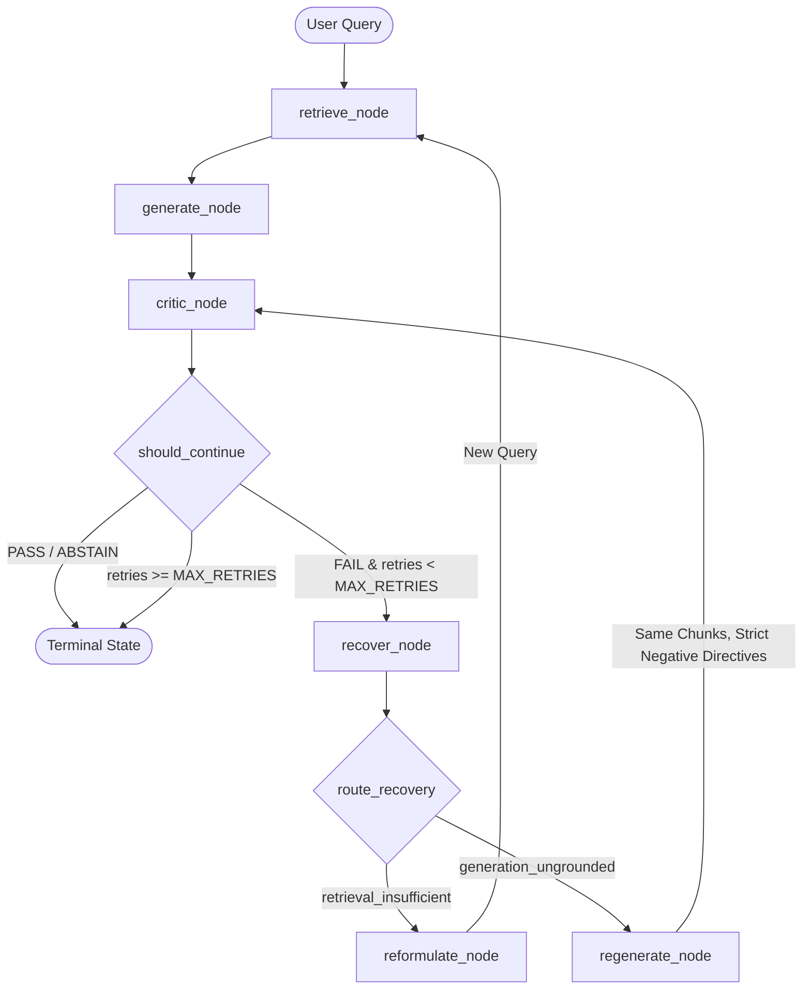

# Self-Healing RAG

A robust, self-correcting Retrieval-Augmented Generation (RAG) system built with **LangGraph**, **ChromaDB**, **Sentence-Transformers**, and **Hugging Face Inference Providers**.

Unlike traditional single-pass RAG pipelines that blindly return whatever an LLM generates from initial vector search results, Self-Healing RAG introduces a cyclical critique, query reformulation, and constrained regeneration state machine that actively diagnoses and recovers from retrieval deficiencies and ungrounded hallucinations.

---

## Architecture Overview

The system compiles an autonomous state machine using LangGraph. The generation is verified by a structured Critic before being returned to the user:



### Key Workflow Loops & Invariants

1. **Direct Success**: If retrieved chunks contain sufficient evidence and the LLM produces a grounded answer, the Critic issues `PASS` on iteration 1.
2. **Retrieval Insufficiency Loop**: When retrieved chunks lack required facts, the Critic flags `retrieval_insufficient`. The graph routes through `reformulate_node`, which leverages prior query history and critic feedback to formulate a distinct search query, returning to `retrieve_node`.
3. **Ungrounded Generation Loop**: When retrieved evidence is adequate but the LLM hallucinates unsupported claims, the Critic flags `generation_ungrounded` and extracts the specific unsupported claims. The graph routes to `regenerate_node`, which directs the LLM to rewrite the answer using **only** the original chunks without re-retrieval.
4. **Safe Abstention Shortcut**: When queries are inherently unanswerable or out-of-domain, the generator produces an explicit abstention statement. The Critic fast-fails with an `ABSTAIN` verdict, halting execution safely without infinite retry loops.

For deeper architectural specifications and ADR design records, see [ARCHITECTURE.md](ARCHITECTURE.md) and [DECISIONS.md](DECISIONS.md).

---

## Project Structure

```
├── config/                  # Centralized configuration (pydantic-settings)
│   └── settings.py          # Environment settings, models, paths, retry caps
├── data/                    # Local vector database storage (ChromaDB persistence)
├── logs/                    # Application runtime logs
├── src/
│   ├── baseline/            # Single-pass baseline RAG implementation for comparison
│   ├── critic/              # Pydantic schemas, validation, prompts, and Critic class
│   ├── evaluation/          # Benchmark dataset, evaluation engine, and report generation
│   ├── generation/          # InferenceClient interface, RAG & regeneration prompts
│   ├── graph/               # LangGraph workflow, nodes, and recovery edge routers
│   ├── ingestion/           # Document loader, character chunker, and local embedder
│   ├── retrieval/           # Vector retriever with similarity scoring
│   └── schema.py            # Shared Document, Chunk, RetrievalResult, and GraphState
├── tests/                   # 129 comprehensive pytest unit & integration tests
├── demo.py                  # Interactive demonstration script (offline & live modes)
├── ARCHITECTURE.md          # Technical architectural specification
├── BUG_LOG.md               # Defect audit and resolution log
├── DECISIONS.md             # Architectural Decision Records (ADRs D-001 - D-013)
├── PROJECT_PLAN.md          # Master roadmap & completed milestones
├── pyproject.toml           # Build configuration & dependency declarations
└── .env.example             # Template for API credentials and local paths
```

---

## Setup & Installation

### 1. Prerequisites
* Python 3.11+
* Git

### 2. Environment Setup

```bash
# Clone repository
git clone https://github.com/Vishal45718/Self_Healing_RAG.git
cd Self_Healing_RAG

# Create virtual environment
python3.11 -m venv .venv
source .venv/bin/activate

# Install project and development dependencies
pip install -e ".[dev]"
```

### 3. Configuration

Copy the example environment file:

```bash
cp .env.example .env
```

Configure `.env` with your settings:

```env
# LLM Provider Selection ("gemini" [default] or "huggingface")
LLM_PROVIDER=gemini

# Google Gemini Configuration (Default Provider)
GEMINI_API_KEY=your_gemini_api_key_here
GEMINI_MODEL_ID=gemini-3.6-flash

# Hugging Face Configuration (Alternative Provider)
HF_TOKEN=your_huggingface_token_here
HF_PROVIDER=together
LLM_MODEL_ID=meta-llama/Llama-3.3-70B-Instruct
EMBEDDING_MODEL_ID=sentence-transformers/all-MiniLM-L6-v2

# Storage & Runtime Configuration
CHROMA_PATH=./data/chroma
MAX_RETRIES=3
```

> **Note on Providers**: The system defaults to **Google Gemini** (`gemini-3.6-flash`) via the official `google-genai` SDK using `GEMINI_API_KEY`. It also fully supports **Hugging Face Inference Providers** (via `HF_TOKEN` and `HF_PROVIDER`). If neither key is configured, all offline test suites and demonstration scripts execute seamlessly in deterministic offline mode.

---

## Interactive Demonstration (`demo.py`)

A standalone script is included to demonstrate the three foundational scenarios of Self-Healing RAG:

1. **Normal Successful Answer**: Fast single-pass generation on factual queries.
2. **Critic Rejection & Recovery**: An initial hallucinated claim is flagged by the Critic, prompting strict regeneration from the same retrieved chunks to reach a verified `PASS`.
3. **Safe Abstention**: Unanswerable and out-of-domain queries trigger clean abstention without hallucinating or exhausting retries.

### Running the Demo

```bash
# Run in deterministic offline mode (100% reproducible, no API token required)
python demo.py --offline

# Run in live mode with configured LLM API (Google Gemini or Hugging Face)
python demo.py --live
```

---

## How to Ingest & Run Programmatically

### Ingesting Documents into ChromaDB

```python
from src.ingestion.loader import DocumentLoader
from src.ingestion.chunker import RecursiveCharacterChunker
from src.ingestion.embedder import LocalEmbedder
from src.ingestion.vector_store import VectorStore

# 1. Load documents (supports .txt, .md, .pdf)
loader = DocumentLoader()
documents = loader.load_directory("path/to/docs")

# 2. Chunk documents with semantic overlap & deterministic SHA-256 IDs
chunker = RecursiveCharacterChunker(chunk_size=500, chunk_overlap=50)
chunks = chunker.chunk_documents(documents)

# 3. Compute local dense embeddings (runs locally on CPU/GPU)
embedder = LocalEmbedder()
embeddings = embedder.embed_chunks(chunks)

# 4. Upsert into persistent Chroma collection
vector_store = VectorStore(collection_name="my_knowledge_base")
vector_store.upsert(chunks=chunks, embeddings=embeddings)
```

### Executing Self-Healing RAG

```python
from src.ingestion.vector_store import VectorStore
from src.ingestion.embedder import LocalEmbedder
from src.retrieval.retriever import Retriever
from src.generation.generator import Generator
from src.critic.critic import Critic
from src.graph.graph import SelfHealingRAG

# Initialize components
vector_store = VectorStore(collection_name="my_knowledge_base")
embedder = LocalEmbedder()
retriever = Retriever(vector_store=vector_store, embedder=embedder)
generator = Generator()
critic = Critic()

# Compile LangGraph self-healing pipeline
rag = SelfHealingRAG(retriever=retriever, generator=generator, critic=critic)

# Execute query with self-healing feedback loop
state = rag.invoke("What are the primary storage guarantees of ChromaDB?")

print(f"Final Answer: {state['generation']}")
print(f"Verdict: {state['critic_evaluation'].verdict.value}")
print(f"Iterations: {state['iterations']}")
print(f"Query History: {state['query_history']}")
```

---

## Baseline RAG vs. Self-Healing RAG

| Dimension | Baseline RAG (`BaselineRAG`) | Self-Healing RAG (`SelfHealingRAG`) |
|---|---|---|
| **Workflow Architecture** | Linear DAG (`retrieve -> generate`) | Cyclical State Graph (`retrieve -> generate -> critic -> [recover]`) |
| **Hallucination Protection** | None; returns raw LLM generation | Structured Critic verifies groundedness; regenerates on failure |
| **Retrieval Failure Handling** | Generates with poor/empty context | Query reformulation with query-history deduplication |
| **Failure Classification** | Conflates all failures together | Distinguishes `retrieval_insufficient` from `generation_ungrounded` |
| **Unanswerable Questions** | Prone to plausible confabulation | Detects missing evidence and terminates in `ABSTAIN` |
| **Cost & Latency** | Lowest (1 retrieval, 1 generation) | Higher when recovering (amortized across retries) |

---

## Evaluation Benchmark & Workflow

The repository provides a standardized evaluation harness to compare Baseline RAG against Self-Healing RAG on identical vector collections across three scenario categories:
* **Direct Queries**: Factual questions directly answerable from single passages.
* **Vague / Reformulation Queries**: Questions with colloquial, partial, or ambiguous phrasing requiring query reformulation to surface relevant chunks.
* **Unanswerable Queries**: Questions outside the knowledge base designed to evaluate safe abstention and resist hallucination.

### Running the Evaluation Benchmark

To run the evaluation benchmark with your configured model:

```bash
python -m src.evaluation.run_eval --output evaluation_results.json
```

### Tracked Evaluation Metrics

* **Critic Pass Rate**: Proportion of answers verified as factually grounded by the Critic.
* **Groundedness Rate**: Percentage of answers containing zero unsupported claims.
* **Retrieval Sufficiency Rate**: Percentage of retrieval attempts providing complete evidence.
* **Correct Abstention Rate**: Percentage of unanswerable queries yielding `ABSTAIN`.
* **Recovery Success Rate**: Proportion of queries failing on iteration 1 that successfully self-healed to `PASS` or `ABSTAIN`.
* **Latency Overhead & LLM Call Ratio**: Wall-clock latency (ms) and total inference calls comparing the cyclical loop to single-pass execution.

---

## Automated Test Suite

The project enforces test cleanliness with deterministic unit tests, mock dependency injection, and zero network calls required for standard testing.

```bash
# Run full automated test suite
pytest -v
```

### Current Test Suite Status

* **129 Collected Tests**:
  * `tests/test_baseline.py`: 7 tests (single-pass baseline behavior)
  * `tests/test_chunker.py`: 6 tests (recursive chunking & SHA-256 chunk IDs)
  * `tests/test_critic.py`: 12 tests (Pydantic validation, verdicts, shortcuts)
  * `tests/test_demo.py`: 2 tests (demo script offline execution & client mocks)
  * `tests/test_embedder.py`: 11 tests (sentence-transformers embeddings)
  * `tests/test_evaluation.py`: 13 tests (dataset parsing, runner, metrics math)
  * `tests/test_generator.py`: 9 tests (generation schemas & empty context handling)
  * `tests/test_graph.py`: 5 tests (LangGraph state transitions & validation)
  * `tests/test_integration_hf.py`: 1 test (live Hugging Face inference connectivity)
  * `tests/test_loader.py`: 8 tests (text, markdown, and PDF extraction)
  * `tests/test_reformulation.py`: 24 tests (recovery routing, query deduplication)
  * `tests/test_retriever.py`: 8 tests (vector similarity and top-k filtering)
  * `tests/test_settings.py`: 2 tests (pydantic-settings environment loading)
  * `tests/test_vector_store.py`: 13 tests (Chroma persistence & idempotency)
* **Results**: **129 Passed, 2 warnings** (Live HF integration test skips cleanly when token lacks serverless inference scope; zero code defects).

---

## Known Limitations

1. **Local Embedding Latency**: Default embeddings run locally on CPU via `sentence-transformers`. Ingesting large document collections (10,000+ pages) without a CUDA GPU will be compute-bound.
2. **Sequential Recovery Overhead**: Query reformulation and answer regeneration run sequentially. When self-healing loops trigger, end-to-end latency increases proportionally with each retry iteration.
3. **Critic Model Dependency**: The accuracy of the Critic relies on the underlying LLM's adherence to structured JSON output and rigorous factual discrimination. Smaller quantizations (<8B parameters) may produce higher false-positive rates during critique.
4. **Provider Rate Limiting**: When using public serverless Hugging Face Inference Providers, burst queries across evaluation runs may encounter HTTP 429 rate limits unless dedicated endpoints or paid provider tiers are configured.
5. **Single Collection Scope**: The current vector store indexes into a single isolated collection per instance; cross-collection federated retrieval is not supported.

---

## License

MIT License. See [LICENSE](LICENSE) for details.
